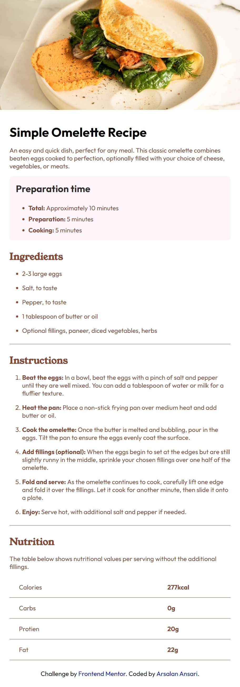
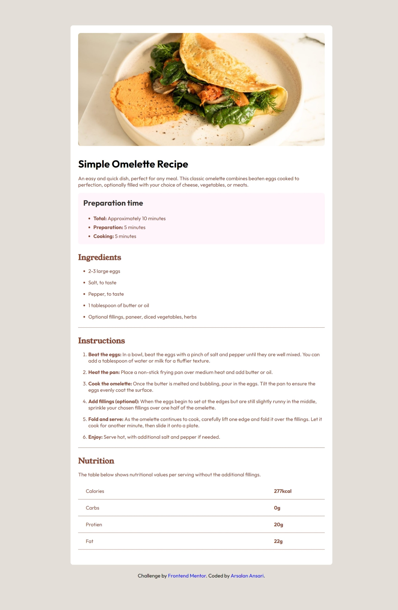

# Frontend Mentor - Recipe page solution

This is a solution to the [Recipe page challenge on Frontend Mentor](https://www.frontendmentor.io/challenges/recipe-page-KiTsR8QQKm).

## Table of contents

- [Overview](#overview)
  - [Screenshot](#screenshot)
  - [Links](#links)
- [My process](#my-process)
  - [Built with](#built-with)
  - [What I learned](#what-i-learned)
- [Author](#author)

**Note: Delete this note and update the table of contents based on what sections you keep.**

## Overview

### Screenshot

Here is the mobile layout

Here is the desktop layout

### Links

- Solution URL: [Add solution URL here](https://github.com/arsalanansariofficial/recipe-page.git)

## My process

### Built with

- Semantic HTML5 markup
- CSS custom properties
- Flexbox
- Mobile-first workflow

### What I learned

Its a really great experience using flexbox to place the items at their desired place and also the new CSS features that allows you to write nested CSS rules.

## Author

- Website - [Arsalan Ansari](https://www.github.com/arsalanansariofficial)
- Frontend Mentor - [@arsalanansariofficial](https://www.frontendmentor.io/profile/arsalanansariofficial)
